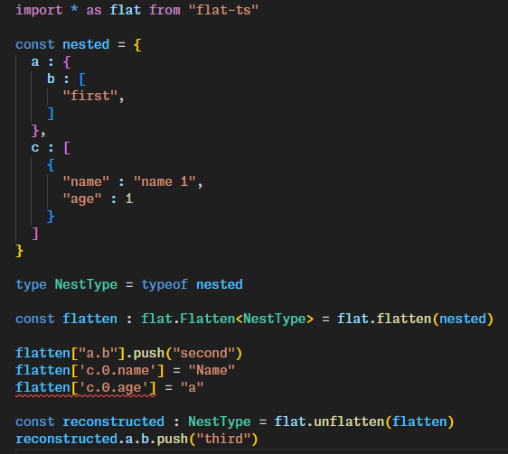

# Introduction

Flatten nested data while preserving types.



# Install

> npm i flatten-type

# Usage

```
import * as flat from "flatten-type"

const nested = // define your nested data

const flatten = flat.flatten(nested)
const reconstructed : TypeHint = flat.unflatten(flatten)
```
