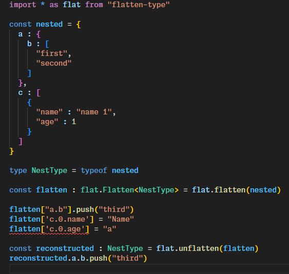

# Introduction

Flatten nested data preserving types.



# Install

> npm i flat-ts

# Usage

```
import * as flat from "flat-ts"

const flatten = flat.flatten(data)
const unflatten : TypeHint = flat.unflatten(data)
```
